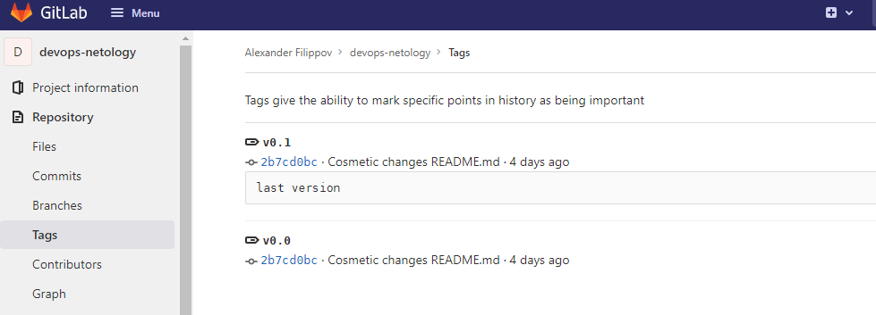
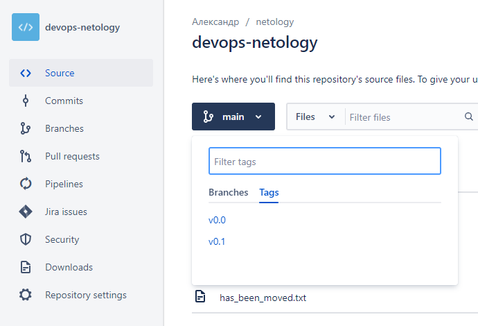

# Домашнее задание к занятию «2.2. Основы Git»

## Задание №1 – Знакомимся с gitlab и bitbucket 
1. Обратите внимание, как изменился результат работы команды `git remote -v`.

Если все проделано правильно, то результат команды `git remote -v` должен быть следующий:
```bash
$ git remote -v
bitbucket https://Filipp0vAP@bitbucket.org/filipp0vap/devops-netology.git (fetch)
bitbucket https://Filipp0vAP@bitbucket.org/filipp0vap/devops-netology.git (push)
gitlab  https://gitlab.com/Filipp0vAP/devops-netology.git (fetch)
gitlab  https://gitlab.com/Filipp0vAP/devops-netology.git (push)
origin  https://github.com/Filipp0vAP/devops-netology.git (fetch)
origin  https://github.com/Filipp0vAP/devops-netology.git (push)
```

## Задание №2 – Теги

Представьте ситуацию, когда в коде была обнаружена ошибка - надо вернуться на предыдущую версию кода,
исправить ее и выложить исправленный код в продакшн. Мы никуда код выкладывать не будем, но пометим некоторые коммиты тегами и 
создадим от них ветки. 

1. Создайте легковестный тег `v0.0` на HEAD коммите и запуште его во все три добавленных на предыдущем этапе `upstream`.
1. Аналогично создайте аннотированный тег `v0.1`.
1. Перейдите на страницу просмотра тегов в гитхабе (и в других репозиториях) и посмотрите, чем отличаются созданные теги. 
    * В гитхабе – https://github.com/YOUR_ACCOUNT/devops-netology/releases
    * В гитлабе – https://gitlab.com/YOUR_ACCOUNT/devops-netology/-/tags
    * В битбакете – список тегов расположен в выпадающем меню веток на отдельной вкладке. 



## Задание №3 – Ветки 

Давайте посмотрим, как будет выглядеть история коммитов при создании веток. 

1. Переключитесь обратно на ветку `main`, которая должна быть связана с веткой `main` репозитория на `github`.
1. Посмотрите лог коммитов и найдите хеш коммита с названием `Prepare to delete and move`, который был создан в пределах предыдущего домашнего задания. 
1. Выполните `git checkout` по хешу найденного коммита. 
1. Создайте новую ветку `fix` базируясь на этом коммите `git switch -c fix`.
1. Отправьте новую ветку в репозиторий на гитхабе `git push -u origin fix`.
1. Посмотрите, как визуально выглядит ваша схема коммитов: https://github.com/YOUR_ACCOUNT/devops-netology/network. 
1. Теперь измените содержание файла `README.md`, добавив новую строчку.
1. Отправьте изменения в репозиторий и посмотрите, как изменится схема на странице https://github.com/YOUR_ACCOUNT/devops-netology/network 
и как изменится вывод команды `git log`.

## Задание №4 – Упрощаем себе жизнь

Давайте попробуем поработь с Git при помощи визуального редактора. 

1. В используемой нами IDE Py Charm откройте визуальный редактор работы с git, находящийся в меню View -> Tool Windows -> Git.
1. Измените какой-нибудь файл, и он сразу появится на вкладке `Local Changes`, отсюда можно выполнить коммит нажав на кнопку внизу этого диалога. 
1. Элементы управления для работы с гитом будут выглядеть примерно вот так:
   
1. Попробуйте выполнить пару коммитов используя IDE. 

https://www.jetbrains.com/help/pycharm/commit-and-push-changes.html – здесь можно найти справочную информацию по визуальному интерфейсу. 
И если вверху экрана выбрать свою операционную систему, то можно посмотреть горячие клавиши для работы с гитом. 
Подробней о визуальном интерфейсе будет рассказано на одной из следующих лекций.

В виде результата работы по всем заданиям приложите ссылки на все три ваших репозитория в github, gitlab и bitbucket.  

## Результаты ДЗ
https://github.com/Filipp0vAP/devops-netology/
https://gitlab.com/Filipp0vAP/devops-netology
https://bitbucket.org/filipp0vap/devops-netology/

Для выполнения 4 задания использовал другой проект, так как основные задания выполняю на виртуалке с убунту через командную строку
где не установлен PyCharm. Но он у меня установлен на основной машине, коммиты из него можно увидеть тут:
https://github.com/Filipp0vAP/netology-sysadm-homeworks