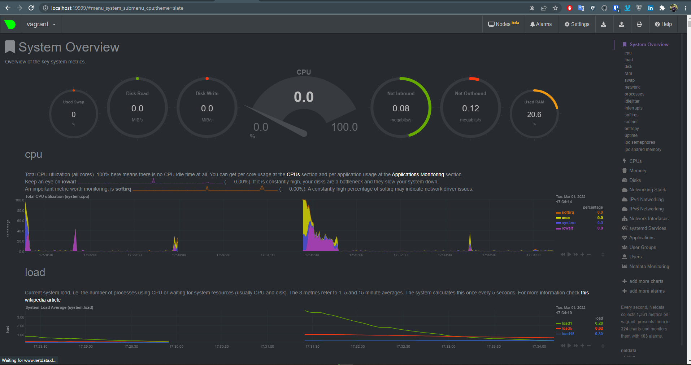

# Домашнее задание к занятию "3.4. Операционные системы, лекция 2"

1. На лекции мы познакомились с [node_exporter](https://github.com/prometheus/node_exporter/releases). В демонстрации его исполняемый файл запускался в background. Этого достаточно для демо, но не для настоящей production-системы, где процессы должны находиться под внешним управлением. Используя знания из лекции по systemd, создайте самостоятельно простой [unit-файл](https://www.freedesktop.org/software/systemd/man/systemd.service.html) для node_exporter:

    * поместите его в автозагрузку,
    * предусмотрите возможность добавления опций к запускаемому процессу через внешний файл (посмотрите, например, на `systemctl cat cron`),
    * удостоверьтесь, что с помощью systemctl процесс корректно стартует, завершается, а после перезагрузки автоматически поднимается.
   
   # Ответ
   установил node_exporter 
   ```bash
   wget https://github.com/prometheus/node_exporter/releases/download/v*/node_exporter-*.*-amd64.tar.gz
   tar xvfz node_exporter-1.3.1.linux-amd64.tar.gz
   cd node_exporter-1.3.1.linux-amd64.tar.gz
   ```
   
   создал unit файл
   ```bash 
   nano /etc/systemd/system/node_exporter.service
   ```
   содержимое:
   ```bash
   [Unit]
   Description=Node Exporter

   [Service]
   ExecStart=/home/vagrant/node_exporter-1.3.1.linux-amd64/node_exporter
   EnvironmentFile=/etc/default/node_exporter

   [Install]
   WantedBy=default.target
   ```
   и создал файл с переменными
   ```bash
   nano /etc/default/node_exporter
   ```
   добавил файл в автозагрузку
   ```bash
   sudo systemctl enable node_exporter.service
   ```
   
   так же пробросил порт 9100 с ВМ на хост чтоб смотреть метрику
   ```bash
   Vagrant.configure("2") do |config|
 	   config.vm.box = "bento/ubuntu-20.04"
	   config.vm.network "forwarded_port", guest: 9100, host: 9100
   end
   ```
   все функции работают корректно:
   *с помощью systemctl процесс корректно стартует, завершается, а после перезагрузки автоматически поднимается.*
   
   update:
   так понимаю что бы передавать параметры извне нужно использовать следующую конфигурацию:
   ```bash
   ExecStart=/home/vagrant/node_exporter-1.3.1.linux-amd64/node_exporter -f $EXTRA_OPTS
   ```
   
   
   
2. Ознакомьтесь с опциями node_exporter и выводом `/metrics` по-умолчанию. Приведите несколько опций, которые вы бы выбрали для базового мониторинга хоста по CPU, памяти, диску и сети.
	# Ответ
	CPU 
	node_cpu_seconds_total

	Filesystem 
	node_filesystem_avail_bytes

	RAM
	node_memory_MemAvailable_bytes

	NETWORK
	node_network_receive_bytes_total
3. Установите в свою виртуальную машину [Netdata](https://github.com/netdata/netdata). Воспользуйтесь [готовыми пакетами](https://packagecloud.io/netdata/netdata/install) для установки (`sudo apt install -y netdata`). После успешной установки:
    * в конфигурационном файле `/etc/netdata/netdata.conf` в секции [web] замените значение с localhost на `bind to = 0.0.0.0`,
    * добавьте в Vagrantfile проброс порта Netdata на свой локальный компьютер и сделайте `vagrant reload`:

    ```bash
    config.vm.network "forwarded_port", guest: 19999, host: 19999
    ```

    После успешной перезагрузки в браузере *на своем ПК* (не в виртуальной машине) вы должны суметь зайти на `localhost:19999`. Ознакомьтесь с метриками, которые по умолчанию собираются Netdata и с комментариями, которые даны к этим метрикам.
	# Ответ
	

4. Можно ли по выводу `dmesg` понять, осознает ли ОС, что загружена не на настоящем оборудовании, а на системе виртуализации?
	# Ответ
	```bash
	vagrant@vagrant:~$ dmesg |grep virtualiz
	[    0.010266] CPU MTRRs all blank - virtualized system.
	[    0.063507] Booting paravirtualized kernel on KVM
	[   22.763732] systemd[1]: Detected virtualization oracle.
	```
	Судя по всему да
5. Как настроен sysctl `fs.nr_open` на системе по-умолчанию? Узнайте, что означает этот параметр. Какой другой существующий лимит не позволит достичь такого числа (`ulimit --help`)?
	# Ответ
	```bash
	vagrant@vagrant:~$ /sbin/sysctl -n fs.nr_open
	1048576
	```
	 Это лимит на количество открытых дескрипторов
	 
	 Другой лимит можно посмотреть так:
	 ```bash
	 vagrant@vagrant:~$ ulimit -Sn
	 1024
	 ```
	
6. Запустите любой долгоживущий процесс (не `ls`, который отработает мгновенно, а, например, `sleep 1h`) в отдельном неймспейсе процессов; покажите, что ваш процесс работает под PID 1 через `nsenter`. Для простоты работайте в данном задании под root (`sudo -i`). Под обычным пользователем требуются дополнительные опции (`--map-root-user`) и т.д.
	#Ответ
	```bash
	root@vagrant:~# ps -e |grep sleep
	2020 pts/2    00:00:00 sleep
	root@vagrant:~# nsenter --target 2020 --pid --mount
	root@vagrant:/# ps
	PID TTY          TIME CMD
	2 pts/0    00:00:00 bash
	11 pts/0    00:00:00 ps
	```

7. Найдите информацию о том, что такое `:(){ :|:& };:`. Запустите эту команду в своей виртуальной машине Vagrant с Ubuntu 20.04 (**это важно, поведение в других ОС не проверялось**). Некоторое время все будет "плохо", после чего (минуты) – ОС должна стабилизироваться. Вызов `dmesg` расскажет, какой механизм помог автоматической стабилизации. Как настроен этот механизм по-умолчанию, и как изменить число процессов, которое можно создать в сессии?
	
	#Ответ
	Как я понял это функция которая вызывает два своих клона, которые в свою очередь создают два своих и так до бесконечности нагружая систему.
	и  я так понял в системе можно ограничить количество одновременное колличество процессов командой ulimit
	видимо по достижении этого лимита система начинает блокировать создание новых
	
	update:
	судя по всему вот этот функционал остановил:
	[ 3099.973235] cgroup: fork rejected by pids controller in /user.slice/user-1000.slice/session-4.scope
	[ 3103.171819] cgroup: fork rejected by pids controller in /user.slice/user-1000.slice/session-11.scope
